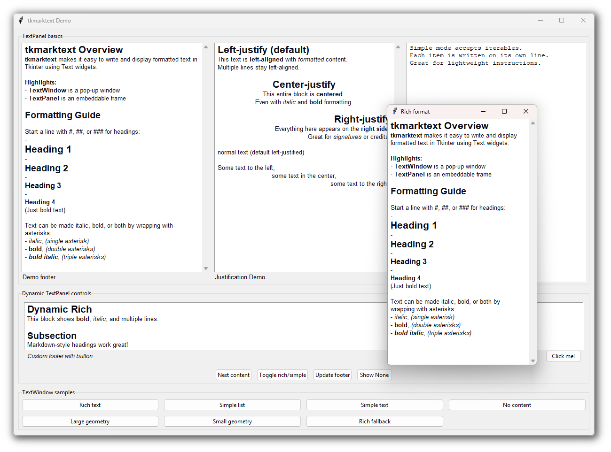

# TkMarkText

A simple Python module for displaying formatted or plain text in Tkinter GUIs.
Provides embeddable panels and pop-up windows with Markdown-like formatting.



## Installation

Tested on Python 3.10

You can install TkMarkText using one of the following methods:

### Method (A)

Install via pip using git:

```sh
pip install git+https://github.com/Nenotriple/TkMarkText.git
```

### Method (B)

Clone and install in your environment:

```sh
git clone https://github.com/Nenotriple/TkMarkText.git
cd TkMarkText
# Optionally install as editable package
pip install -e .
```

### Method (C)

Copy `tkmarktext/` into your project.

## Usage

### Entry Points

- **`TextPanel`**: Embeddable frame for formatted or plain text.
- **`TextWindow`**: Pop-up window for formatted or plain text.

#### `TextPanel` Parameters

| Parameter           | Description                                        |
|---------------------|----------------------------------------------------|
| `master`            | Parent widget.                                     |
| `text`              | String, list, or dict to display.                  |
| `rich_text`         | Enable Markdown-like formatting (default: `True`). |
| `footer`            | String or callable for footer widget.              |
| `include_scrollbar` | Show scrollbar (default: `True`).                  |
| `**kwargs`          | Additional `ttk.Frame` options.|

#### `TextWindow` Parameters

| Parameter           | Description                                        |
|---------------------|----------------------------------------------------|
| `master`            | Parent widget (optional).                          |
| `title`             | Window title.                                      |
| `geometry`          | Window size (e.g., `"400x300"`).                   |
| `text`              | Content to display.                                |
| `rich_text`         | Enable Markdown-like formatting (default: `True`). |
| `footer`            | String or callable for footer widget.              |
| `include_scrollbar` | Show scrollbar (default: `True`).                  |
| `icon`              | Window icon (optional).                            |
| `**kwargs`          | Additional `tk.Toplevel` options.                  |

### Formatting Reference

| Syntax                                         | Description                                      |
|------------------------------------------------|--------------------------------------------------|
| `# Heading 1`, `## Heading 2`, `### Heading 3` | Headings (levels 1–3)                            |
| `**bold**`                                     | Bold                                             |
| `*italic*`                                     | Italic                                           |
| `***bolditalic***`                             | Bold + Italic                                    |
| `__underline__`                                | Underline                                        |
| `*__italicunderline__*`                        | Italic + Underline                               |
| `**__boldunderline__**`                        | Bold + Underline                                 |
| `***__bolditalicunderline__***`                | Bold + Italic + Underline                        |
| `[justify:center]centered text[/justify]`      | Centered text (use `left`, `center`, or `right`) |

### Example

```python
from tkmarktext import TextPanel, TextWindow

# Embeddable panel
panel = TextPanel(parent, text="**Bold** and *italic* text", rich_text=True)
panel.pack()

# Pop-up window
window = TextWindow(title="Info", text="# Heading\nSome text", rich_text=True)
window.open_window()
```

### Shared Methods

- `set_text(text, rich_text=True)`: Update content and formatting mode.
- `set_font(family=None, color=None)`: Set font family and color.
- `configure(...)`: Update widget options (supports: `text`, `rich_text`, `footer`, `include_scrollbar`).
- `open_window(...)`: Open and update `TextWindow` options (supports: `title`, `geometry`, `text`, `rich_text`, `include_scrollbar`).

### Attribute Access

- `content_frame`: Container frame (`ttk.Frame`) for the text box and optional scrollbar.
- `textbox`: The main text widget (`tk.Text` or `tkinter.scrolledtext.ScrolledText`).
- `current_text`: The current content shown in the text widget.
- `footer`: Footer content; can be a string, a callable, or `None`.
- `footer_widget`: Widget displaying the footer, set if a footer exists.
- `context_menu`: Right-click menu (`tk.Menu`) attached to the text box.

> **Note:** See [`demo.py`](demo.py) for a full demonstration.
